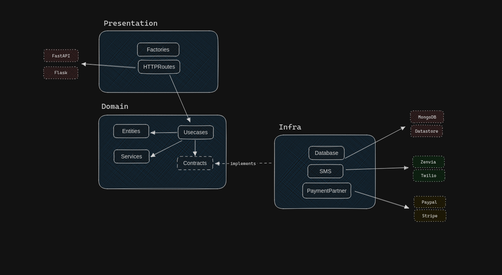

# py-awesome-template

Kickstart your Python 3.14 project with Clean Architecture. This robust template embraces the principles of Clean Architecture. This template not only provides a well-organized folder structure but also comes pre-configured with essential tools and settings, including code styling, continuous integration and Docker support.

## Features

- Clean Architecture Structure: The project template follows [Uncle Bob's Clean Architecture](https://blog.cleancoder.com/uncle-bob/2012/08/13/the-clean-architecture.html) principles. The clear separation of layers ensures maintainability, testability, and scalability.

- Code Quality Tooling: [ruff](https://docs.astral.sh/ruff/) (lint + format), [mypy](https://mypy-lang.org/) (type check), [bandit](https://bandit.readthedocs.io/) (security), [vulture](https://github.com/jendrikseipp/vulture) (dead code), [xenon](https://github.com/rubik/xenon) (cyclomatic complexity) and [pip-audit](https://github.com/pypa/pip-audit) (dependency vulnerabilities), all wired into [pre-commit](https://pre-commit.com/) hooks.

- Test Coverage Gate: pytest with an 80% minimum coverage threshold.

- Continuous Integration (GitHub Actions): Every pull request runs all quality checks and tests, and posts coverage and quality reports as PR comments.

- Dependabot: Weekly grouped updates for Python dependencies and GitHub Actions.

- Production Ready Basics: typed settings with [pydantic-settings](https://docs.pydantic.dev/latest/concepts/pydantic_settings/), structured JSON logs in production, configurable CORS, domain errors mapped to HTTP status codes and a `/health` route.

- Docker Support: a `dev` stage with hot reload and a slim, non-root `production` stage with healthcheck.

## Setup project

### Getting Started

Run `make setup` to install [uv](https://docs.astral.sh/uv/) (if missing), the project dependencies (uv fetches Python 3.14 if needed), create the `.env` file and install the git hooks.

Then run `make run` to start the server locally, or `make dev` to run it with Docker ([install guide](https://docs.docker.com/engine/install/)).

### Environment variables

Settings are loaded from environment variables (or the `.env` file) by `app/domain/common/envs/settings.py`. Add new variables there and to `.env.example`.

| Variable     | Default                   | Description                                                   |
| ------------ | ------------------------- | ------------------------------------------------------------- |
| APP_PORT     | -                         | Host port used by `make dev`.                                 |
| ENV          | development               | `development`, `test` or `production`. Production logs JSON.  |
| LOG_LEVEL    | INFO                      | Python logging level.                                         |
| CORS_ORIGINS | []                        | JSON list of allowed origins, e.g. `["http://localhost:3000"]`. |

### Installing Dependencies

Manage project dependencies in the pyproject.toml file. Dependencies are managed with [uv](https://docs.astral.sh/uv/). Use `uv add <package>` for production dependencies (`project.dependencies`) and `uv add --dev <package>` for test and development dependencies (`dependency-groups.dev`). Commit the generated `uv.lock` file.

### Available commands

Use the following commands in the root folder with **make**:

| Command          | Description                                                                             |
| ---------------- | --------------------------------------------------------------------------------------- |
| make setup       | Install uv, project dependencies and git hooks.                                         |
| make run         | Run the project locally with uv.                                                        |
| make dev         | Run the project with Docker.                                                            |
| make dev-build   | Run the project with Docker, rebuilding the image. Useful after changing the Dockerfile. |
| make build       | Build the production docker image.                                                      |
| make test        | Run all tests (unit + integration) with coverage.                                       |
| make test-unit   | Run only the unit tests.                                                                |
| make hooks       | Run all quality checks (ruff, mypy, bandit, vulture, xenon, pip-audit).                 |
| make check-code  | Lint and check code formatting with ruff.                                               |
| make format-code | Fix lint issues and format code with ruff.                                              |

### Config files

| File                      | Description                                                                                          |
| ------------------------- | ---------------------------------------------------------------------------------------------------- |
| .dockerignore             | Files excluded from the docker build context.                                                        |
| .env.example              | Define environment variables. Create a .env file in the project root based on .env.example.          |
| .python-version           | Python version used by uv.                                                                           |
| .pre-commit-config.yaml   | Git hooks running all quality checks before each commit.                                             |
| .vscode/settings.json     | VS Code settings: ruff as formatter on save and pytest integration.                                  |
| Makefile                  | Create shortcuts for commands using make.                                                            |
| pyproject.toml            | Project details, dependencies and ruff, mypy, pytest, coverage, vulture and xenon configurations.    |
| uv.lock                   | Locked dependency versions. Commit it.                                                               |
| .github/workflows/ci.yml  | GitHub Actions CI configuration file.                                                                |
| .github/dependabot.yaml   | Dependabot configuration for dependency updates.                                                     |

## Architecture and Folder Structure



This template uses an architecture and folder structuring based on uncle bob's clean architecture.
The layers (folders) have the following responsibilities:

### Main

Starting point where settings and logging are loaded and the "app" is created.

### Domain

The core layer housing use cases, models, entities, services, common code (`common/`: settings, domain errors, constants and enums), and contracts. Contracts are interfaces that abstract external libraries or services, implemented in the infrastructure layer. The domain layer should never directly access other layers but interact through interfaces using dependency injection.

### Presentation

The layer for accessing the application's use cases and exposing the application to the external world, often through HTTP/REST (e.g., FastAPI or Flask). The presentation layer utilizes the factory pattern to instantiate classes needed to execute a use case. Domain errors (`NotFoundError`, `ConflictError`, ...) raised by use cases are converted to HTTP responses by `handlers/domain_error_handler.py`.

### Infra

Handles integrations with external APIs, libraries, or services. The integration implementation classes must adhere to contracts defined in the domain layer.

### Tests

Tests live in `tests/`, outside the application code, mirroring the `app/` structure: `tests/unit/` for fast tests with mocked dependencies and `tests/integration/` for HTTP tests with `TestClient`.

## Example Usage

Explore the [example branch](https://github.com/mathmed/py-awesome-template/tree/example) to see a practical demonstration of using the template. The example includes routes for creating a user, authentication, and accessing routes that require authentication.

To run the example, switch to **example** branch

```sh
$ git checkout example
```

Run the server

```sh
$ make dev-build
```

#### Create user route example

```sh
curl --request POST \
  --url http://localhost:5000/users \
  --header 'Content-Type: application/json' \
  --data '{
	"name": "Some name",
	"email": "someemail@mail.com",
	"password": "somepassword"
}'
```

#### Signin route example

```sh
curl --request POST \
  --url http://localhost:5000/signin \
  --header 'Content-Type: application/json' \
  --data '{
	"email": "someemail@mail.com",
	"password": "somepassword"
}'
```

#### Authenticated route example

```sh
curl --request GET \
  --url http://localhost:5000/users/some-authenticated-route \
  --header 'Authorization: Bearer <bearer_here>'
```

## License

This project is licensed under the MIT License - see the [LICENSE file](LICENSE) for details. You are free to use, modify, and distribute this template for commercial and non-commercial purposes.
